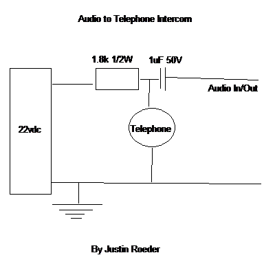

This circuit uses DC voltage to power telephones.
THIS CIRCUIT CAN'T BE USED ON A LANDLINES OR LINES
THAT ALREADY HAVE TELEPHONE SIGMALS. THIS FOR RX AND
TX ON A LINE WITH NO AC. LANDLINES WILL HAVE AROUND
48VAC AND 90VAC FOR THE RINGER. You both TX and RX
on the same Audio input/Output connection.

